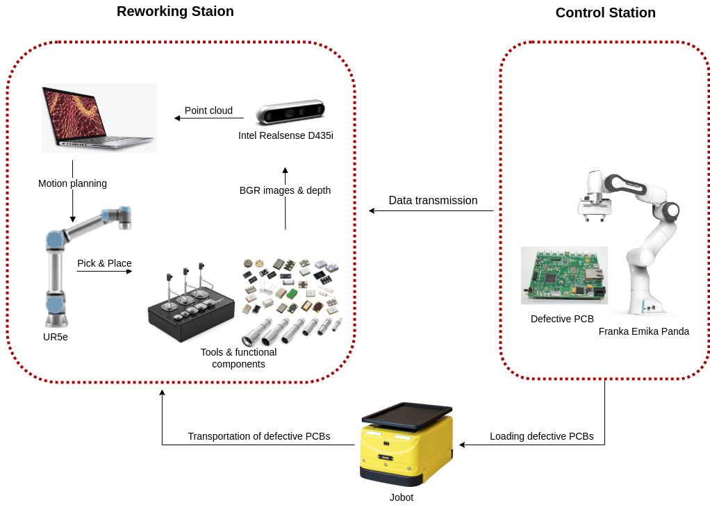

# PrepStation

This repositroy is being developed as one of usecases of  <a href="https://arise-middleware.eu/">ARISE</a>, co-funded by European Union, at the <a href="https://www.industry40lab.org/">INDUSTRY4.0</a> laboratory affiliated with Politecnico di Milano.

By the end of Dec 2024, the project will have completed its first year and the implementation progress has been reported. Initially, the usecase is briefly described. Followingly, the functions of each ros2 packages are explained. 

## Use Case Description:
A defective PCB is identified in the control station, then the control station transmits data of the PCB and the relevant non-functional components to the reworking station; in the reworking station, an UR5e cobot identifies appropriate tools
and prepares the setup of the workspace for the operator. In the meanwhile, an AGV transports the defective PCB from the control station to the reworking station. At the time of arrival, the UR5e cobot unloads the defective PCB. 
The workspace must be prepared before the arrival of the operator. 

