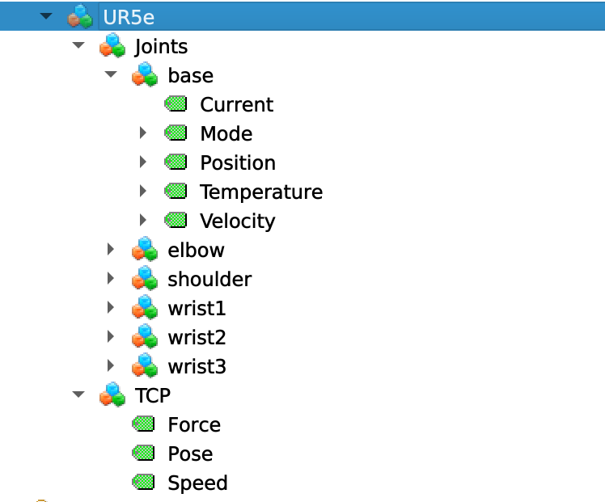

## Introduction

This branch shows the second year development of challenge 7th of the  <a href="https://arise-middleware.eu/">ARISE</a>, co-funded by European Union, at the <a href="https://www.industry40lab.org/">INDUSTRY4.0</a> laboratory affiliated with Politecnico di Milano.

The challange addresses the deployment of HRI to improve the efficiency of worker in high precision and flexible tasks. In the use case, utlizing the Arise tools, it is aimed to decrease the setup of desoldering tasks by displaying unified infromation from different stations. In more details, the unified dispaly of data on a dashboard is achieved relying on the interoperability among different protocols from different data resouces (devices). The messages in the DDS format (comming from Vulcanexus) and OPC-UA (robot) are translated into the NGSI-LD format and are forwarded to FIWARE Orion-LD broker for the handling and storing of data in time series. 

Below different components have been introduced briefly:

 - On the Vulcanexus side, A YOLO model has been trained to detect electronic components particularly, Integrated Circuits(ICs) on the PCBs. On ROS2 server the YOLO model is being runned to accept the request of component detection and it returns the extracted infos. Since the broker does not handl messages with heavy payloads(like images), the annotated image of the pcb is uploaded to a server; the corresponding 'url' and its extraced info are forwarded to the broker as 'pcb meta data' which will be displayed later on a dashboard at the reworking station.  The messages of DDS format are translated to NGSI-LD format using [DDS Enabler](https://github.com/eProsima/DDS-Enabler) developed by Eprosima. 

 - The OPC-UA server of robot (UR5e), is developed based on Open62541 library in POLIMI see this [repo](https://github.com/mosmz95/opcua_rtde.git). The server gets data from RTDE library of UR5e. The serever get angular postion and velocity, temperature and current of each joints and TCP's (tool centring point) position, speed, and force. Then there's an IoT agent that translates that OPC UA data into the NGSI-LD format so that it can be fed into the FIWARE Orion-LD context broker.


 - FIWARE stack:
    In context-driven systems, it is important to track how data changes over time. Within the FIWARE stack, activating temporal interface, using components such as FIWARE Mintaka and Timeseries-DB , lets you automatically store and query historical data. The advantage of the temporal interface is that it is provided by the context broker directly - no subscriptions are needed and HTTP traffic is reduced. Furthermore, the temporal interface can be queried across all context entities, not merely those which satisfy a subscription.

  In simple words, the FIWARE ecosystem is used to unify all these different protocols and make sure that all the robot data, whether it comes from ROS2 or from the OPC UA server, ends up in one place and is easy to visualize.

  <p align="center">
    </a>
  </p>
  <p align="center"><em> Software architecture of temporal interface</em></p>

## Command lines executions

### Run containers
1 - Build the docker compose file
 ```bash
sudo docker compose build
```
2 - Run the docker services
 ```bash
sudo docker compose up
```
#### Run ROS2 pakcages

3- First of all, in a new terminal, run the server where pcb images are uploaded

```bash
sudo docker exec -it pcbinfo bash
python3 -m uvicorn pcb_img_server.run_server:app --host 0.0.0.0 --port 5000
```


4- In a new termianl, run the ROS2 server that runs the YOLO model of component detection  

```bash
sudo docker exec -it pcbinfo bash
ros2 run defective_pcb_detector yolo_detection_server
```
5- In a new termianl, run the ROS2 node to establish the communiation with the camera:  

```bash
sudo docker exec -it pcbinfo bash
ros2 run defective_pcb_detector wrist_camera_publisher
```

6- In a new termianl, run the ROS2 client node that pops up a GUI to select the component of interest:  

```bash
sudo docker exec -it pcbinfo bash
ros2 run defective_pcb_detector component_selection_client
```

<p align="center">
  </a>
</p>
in this step by clicking on the component, the current frame of camera is forwarded to the YOLO model, and the result will be received. 

7- In a new termianl, run the ROS2 node that uploaded the annotated image of PCB to a server and publishes the meta data of PCBs to a topic to which the Orion-LD broker is subscribed. 

```bash
sudo docker exec -it pcbinfo bash
ros2 run defective_pcb_detector defective_pcb_to_server
```

- In case you need source the workspaces
```bash
sudo docker exec -it pcbinfo bash
source /opt/vulcanexus/jazzy/setup.bash
source /control_station_ws/install/setup.bash
```

##### Grafana Dashboard settings

9 - Open your web browser and navigate to `http://localhost:443/`. The default username/password are both `admin`. 
Once logged in, click on **dashboards** on the left menu and select the **pcb_metadata_readable** dashboard.

In case you want to design your panel, you can finde the queries on the data sources as bellow

```bash
SELECT
  ts AS "time",
  compound->>'id' AS pcb_id,
  compound->>'url' AS image_url,
  (compound->>'width')::int AS width,
  (compound->>'height')::int AS height,
  (compound->>'defected')::boolean AS defected,
  (compound->>'defect_loc_x')::float AS x,
  (compound->>'defect_loc_y')::float AS y,
  compound->>'material_info' AS material_info,
  (compound->>'heatsink_number')::int AS heatsink_size,
  compound->>'departured' AS departured
FROM
  attributes
WHERE
  entityId = 'urn:ngsi-ld:pcb:1'
  AND id = 'https://uri.etsi.org/ngsi-ld/default-context/mypcb'
ORDER BY
  ts DESC
LIMIT 1;
```
In our case, Business Text plugin has been chosen as our visualization plugin, and the html code for rendering of json info is:

```bash
      <h2>Defective PCB Info</h2>
      <p><strong>ID:</strong> {{@root.pcb_id}}</p>
      <p><strong>Defected:</strong> {{@root.defected}}</p>
      <p><strong>Material:</strong> {{@root.material_info}}</p>
      <p><strong>Defect Location:</strong> ({{@root.x}}, {{@root.y}})</p>
      <p><strong>Departured:</strong> {{@root.departured}}</p>

      <figure style="text-align: center;">
        
        <figcaption style="font-size: 14px; color: #666; margin-top: 8px;">
          Defective PCB detected on {{@root.departured}}
        </figcaption>
      </figure>
```

<p align="center">
  </a>
</p>

#### OPC-UA interoprability

Before running the docker compose up, make sure that the OPC-UA server is up. In this [config file](configs/iotagent-opcua/config-ld-ur5e.js), you need to configure variables for the connection to the server endpoints, authentications, etc. In addition, it is required to set the mapping tool between OPC-UA variables and NGSI-LD entities. For more detail see [arise poc](https://github.com/Engineering-Research-and-Development/arise-poc/blob/main/docs/ARISE_PoC_Tutorial_Extended.md)

1- The server is run: 
  (screenshot here of server terminal here)
  and the OPC-UA data model of robot is: 

<p align="center">
  </a>
</p>

2- If the mapping is configured correctly the OPC-UA iot agent convert data to NGSI-LD entities which can be dispaly in the dashboard.
    (screenshot here of opc ua server here)
